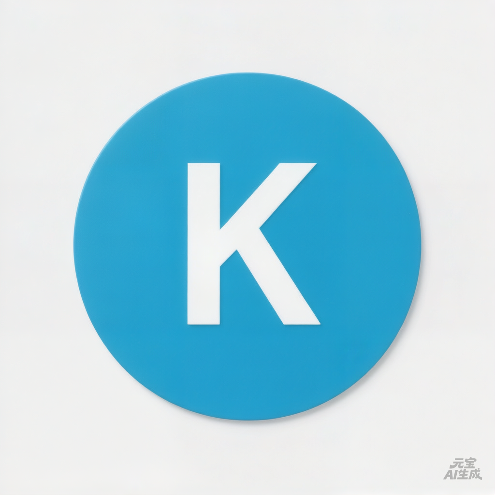

# 🎵 K线会唱歌 · kbarsing

> **K线不只是线，每一根都在唱歌。**

股票K线 → 音乐。走势终完美，旋律亦终完美。



---

## 这是什么

把股票K线变成音乐的神器。

输入一个股票代码，AI 分析走势，生成旋律，K 线图跟着音乐跳舞。

**一句话：让你的股票会唱歌。**

---

## ✨ 效果

| 功能 | 说明 |
|------|------|
| 🎹 **音色选择** | 钢琴、吉他、小提琴、合成器... 10+ 种 |
| 🎸 **节奏风格** | 摇滚、爵士、古典、电子... |
| ⚡ **速度控制** | 慢板、中板、快板，随你调 |
| 📊 **K线可视化** | Canvas 实时渲染，入场动画 |
| 🎬 **音画同步** | 播放线跟着旋律走 |
| 📥 **视频导出** | 录制下载，分享传播 |

---

## 🚀 打开即用

**在线体验：** [kbarsing.com](http://kbarsing.com) 或 [101.35.217.113](http://101.35.217.113)

无需安装，打开就行。

---

## 🛠️ 技术栈

| 层级 | 技术 |
|------|------|
| 前端 | Vanilla JS + HTML5 Canvas + Web Audio |
| 后端 | Flask + NumPy + SciPy（音乐生成） |
| 数据 | 腾讯财经 / 东方财富 API（CORS:*） |
| 部署 | 腾讯云 + Vercel（双平台） |

---

## 📁 项目结构

```
kbarsing/
├── index.html          # 入口
├── assets/
│   ├── js/             # 前端模块
│   │   ├── app.js      # 主应用
│   │   ├── kline.js    # K线动画
│   │   ├── player.js   # 音频播放
│   │   └── ...
│   ├── css/            # 样式
│   └── video/          # 背景视频
├── server/             # Flask 后端
│   ├── app.py          # API 服务
│   └── models/
│       ├── music_generator.py  # 音乐引擎
│       └── stock_data.py       # 数据获取
└── lang/               # 中英文
```

---

## 🔗 相关项目

| 项目 | 说明 |
|------|------|
| [chanvip.skills](https://github.com/chanvip2026/chanvip.skills) | 禅师思想 AI Agent |
| [kbarok/kbarsing](https://github.com/kbarok/kbarsing) | 本仓库 |

---

## 📄 License

MIT License

---

*走势终完美，旋律亦终完美。*
